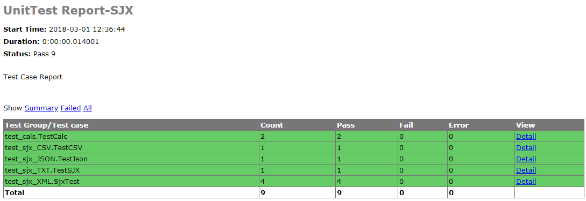

# 
HTML报告生成
   

---

## 目标   

	对单元测试生成HTML报告进行简单回顾    

---
## 1. 如何生成HTML报告？
	
### 1.1. 导入HTML报告模板[模板](../01img/HTMLTestRunner.zip)
	HTMLTestRunner.py

### 1.2 编写生成HTML模块
	
		# 导入unittest包
		import unittest
		# 导入 HTMLTestRunner模板包
		from UnitTest.Day02.ReadData.HTMLTestRunner import HTMLTestRunner
		#导入时间包
		import time
		# 定义测试模块路径
		dirpath='.'
		disconver=unittest.defaultTestLoader.discover(dirpath,pattern='test*.py')
		if __name__=='__main__':
		    #存放报告的文件夹
		    report_dir='../TestReport'
		    #报告名称含时间，时间格式
		    now=time.strftime("%Y-%m-%d %H_%M_%S")
		    #报告完整路径+名称
		    report_name=report_dir+'/'+now+'result.html'
		    #打开报告写入结果
		    with open(report_name,'wb')as f:
		        runner=HTMLTestRunner(stream=f,title="UnitTest Report-SJX",description='Test Case Report')
		        runner.run(disconver)

### 1.3 生成报告示例图

