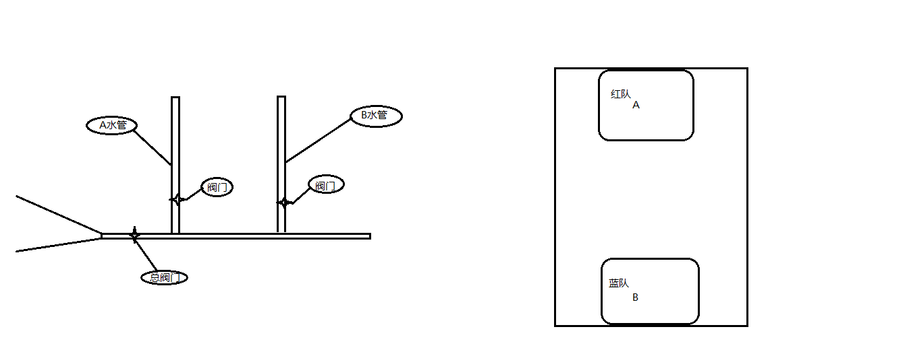

# <center>Jmeter 元件作用域</center> 

--- 

## 目标   

 - 掌握各大元件之间彼此作用域   

---    
## 什么是作用域？    
 我们可以理解为作用域就是：特定的职称或功能只在特定地点或范围内有效；  
   

---  

## 1. Jmeter元件作用域     
在jmeter中，元件的作用域是靠测试计划的树形结构中元件的父子关系来确定;    


### 1.1 作用域的原则   

 ```   
  1. 取样器(sampler)元件内组件不依赖其他元件就可执行,因此取样器不存在作用问题;
  2. 逻辑控制器（Logic Controller）元件作用域只对它的子节点有作用;
  3. 其他作用域默认根据测试计划中树形结构来定；  
	
 ```
## 2. 元件执行顺序：      

```
  1) 配置元件(config elements)
  2) 前置处理程序(Per-processors)
  3) 定时器(timers)
  4) 取样器(Sampler)
  5) 后置处理程序(Post-processors)
  6) 断言(Assertions)
  7) 监听器(Listeners)    

```   
### 2.1 提示    

```
1. 逻辑控制器是个容器，在容器内可添加任意元件内组件，所以它的执行顺序应该是   
   配置元件、前置处理器程序之后，根据逻辑控制器的位置顺序来执行    
   
2. 如果在同一作用域范围内有多个同一类型的元件，则这些元件按照它们在测试计划中的 
   【上下顺序】依次执行 

```